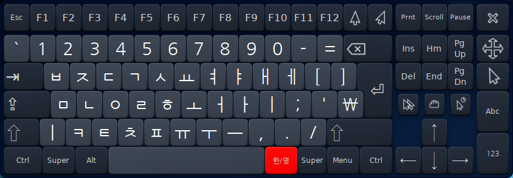
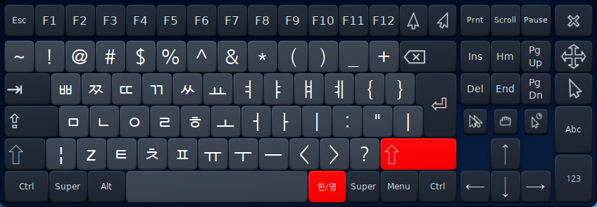
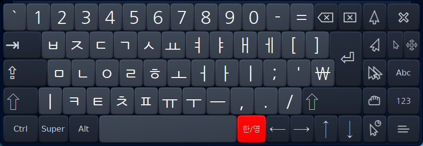
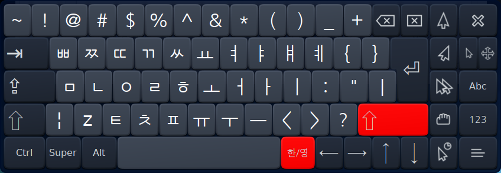

# Korean Keyboard Layout for onboard

한글 사용자를 위한 onboard 레이아웃 






# Install (HamoniKR-ME, HamoniKR-3.0)
```
sudo apt install hamonikr-onboard-layout-ko
```

# Install (Ubuntu, LinuMint, Other debian based Linux)
```
wget -O - http://apt.hamonikr.org/hamonikr.key | sudo apt-key add -
sudo bash -c "echo 'deb https://apt.hamonikr.org jin main upstream' > /etc/apt/sources.list.d/hamonikr-jin.list"
sudo apt-get update
sudo apt install hamonikr-onboard-layout-ko -y
```
# Usage

Onboard Setting > Select Korean Layout

# License

[GPL3](./LICENSE)

